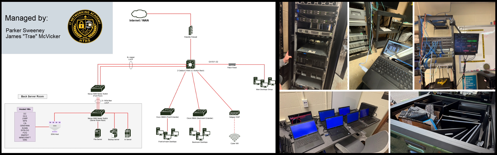

# Harford Technical High School Cyber Lab Infrastructure   [Sep. 2024 - May 2026]

> Two-year student-led administration, upgrades, and redesign of the HTHS Cybersecurity program's lab environment supporting 75+ students, 300+ managed assets, and daily hands-on cybersecurity instruction.

## Highlights 
- **Sole administrators** of all network and systems infrastructure for a 75-student cybersecurity program. Full decision-making control
- **Over 10x'd local file transfer speeds** by redesigning intervlan routing, replacing a single-router bottleneck with dedicated L3 switching
- **Migrated core infrastructure to redundant 10Gb fiber**, eliminating single points of failure across servers and switching
- **Administered a 75-user Active Directory domain**, GPOs, DHCP management, file server management, and 13+ virtualized services on VMware ESXi
- **Deployed and managed 80+ endpoints** via ManageEngine Endpoint Central, including a custom PXE-boot imaging pipeline for 80 new devices
- **Built and deployed monitoring stack for ESXi** (Grafana + InfluxDB + Telegraf) for full visibility across the VM environment
- **Deployed, and continuously managed a asset inventory system** using Snipe-IT for 300+ program asssets. Secure intake, wiping, and redeployment of a ~40-laptop hardware donation
- **Engineered full power and backup redundancy**, new rack layout, new UPS's and rPDU's, and scheduled incremental backups across all services
- **Mentored and trained 4 successors** to take over lab administration on graduation, ensuring continuity of a program used daily by 75+ students

## Overview / Story

The Harford Technical High School Cyber Lab encompasses all the networking and systems infrastructure the HTHS Cybersecurity program uses to conduct classes, labs, and extracurricular activites such as CyberPatriot competitions. This infrastructure includes an internet connection seperate from the school network. In Fall of 2024 we were appointed as the Network Administrators for the lab and given full ownership and decision-making control by our instructor. The network we inherited had many flaws that were drastically impacting performance and the infrastructure lacked many critical services needed for smooth day-to-day operations. Over the next two years, we redesigned the network, upgraded infrastructure, and improved our current systems with new inventory managent, imaging, backup, and monitoring services that hadn't existed before. 

## Component Breakdowns

- **[Network Architecture](docs/network-architecture.md)**: the routing bottleneck
  fix, L3 redesign, and overall network architecture
- **[Identity & Systems](docs/systems-services-and-identity.md)**: Active Directory, GPOs,
  and 13+ virtualized services on ESXi
- **[Monitoring](docs/monitoring.md)**: building
  a Grafana/InfluxDB/Telegraf stack
- **[Endpoint Management](docs/endpoint-management.md)**: fleet management and
  PXE imaging across 80+ devices
- **[Asset & Inventory Management](docs/asset-inventory.md)**: the 300+ asset
  system and the 40-laptop donation

## Architecture

> Note: no exact configurations, IP Addresses, hostnames are listed for safety.

## Tech Stack / Skills

**Networking:**
Cisco IOS, Cisco Nexus (NX-OS), Palo Alto Firewall, VLANs, Layer 2/3 Switching, Inter-VLAN Routing, LACP, Spanning Tree (STP), Fiber Optics, Wireless Networking, DHCP, DNS

**Systems & Virtualization:**
VMware ESXi/vSphere, Windows Server, Ubuntu Server/Linux Administration, Active Directory, Group Policy (GPO), Active Directory Certificate Services (AD CS/PKI), Network Policy Server (NPS/RADIUS), File Services

**Monitoring & Observability:**
Grafana, InfluxDB, Telegraf, Uptime Kuma, Syslog

**Endpoint & Systems Management:**
ManageEngine Endpoint Central, PXE Boot & Network Imaging (FOG), Active Directory Software Deployment, OS Imaging

**Asset Management:**
Snipe-IT, Asset Lifecycle Management, Secure Data Sanitization, Hardware Inventory

**Backup & Resilience:**
Veeam Backup & Replication, Incremental Backups, Disaster Recovery Planning, Redundant Power (UPS/rPDU), Redundant Fiber Links

**Physical Infrastructure:**
Server Rack Design, Cable Management, Fiber, Network Hardware Deployment, Hardware Repair & Troubleshooting

## About

Built and maintained by Parker Sweeney and James "Trae" McVicker, the two student
administrators of the Harford Technical High School Cybersecurity Program lab,
September 2024 to May 2026.

**Parker Sweeney**, University of Maryland, pursuing a B.S. in Computer Science and Mathematics [LinkedIn](https://www.linkedin.com/in/parkersweeney/)

**James McVicker**, Purdue University, pursuing a B.S. in Cybersecurity [LinkedIn](https://www.linkedin.com/in/james-mcvicker-iii-84071b242/)

> Administration was handed off to new student successors upon our graduation in
May 2026. Harford Tech building renovations required the physical infrastructure to be taken down at
year's end, but the lab was fully backed up and documented beforehand so the new team can rebuild
and pick up where we left off.

