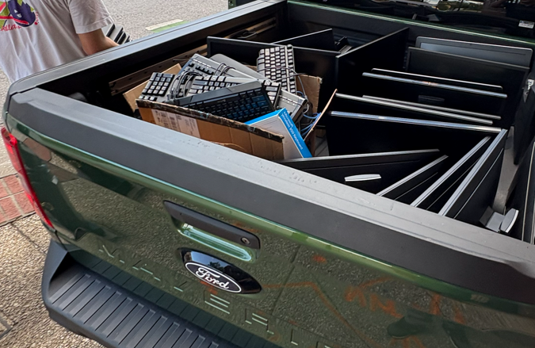
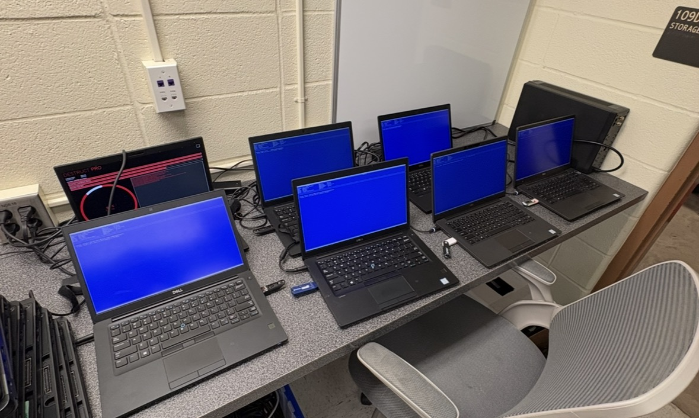

# Asset & Inventory Management

  
  

> Left is us picking up tech donations for the program from a company in Baltimore over the Summer. Right is us doing secure data destruction on the laptops from the donation.

## An Initilal Problem We Faced

No formal inventory system existed for the lab's hardware. Desktops, laptops,
networking gear, etc were tracked informally at best. This became a
real problem as our equipment inventory grew with donations of equipment from local companies. We needed a centralized way to continuously track and manage our invetory.

## What We Built

- Designed and deployed a asset inventory system using Snipe-IT, self-hosted on a VM.
- Built and continuously managed the system over two years as the single source
  of truth for every piece of hardware in the lab
- Managed the secure intake of a ~40-laptop hardware donation, including a
  server rack and additional equipment, from a local company. Over the Summer we securely wiped, re-imaged, and fully inventoried every piece of equipment.

## Result

- **300+ assets** tracked end-to-end, establishing an inventory system that previously
  didn't exist
- Donated hardware was securely handled and track, allowing us to give the donors an accurate receipt of all equipment they gave us.
- Now have a proper system  in place to ensure lab equipment is accounted for and can't go missing without us having a record.
