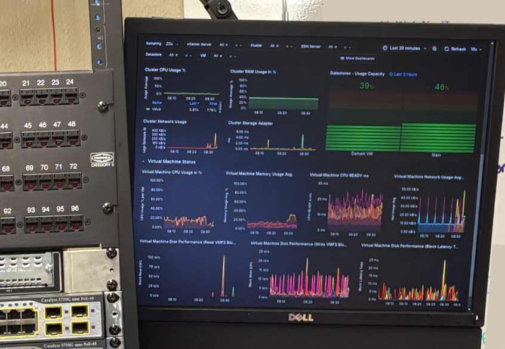
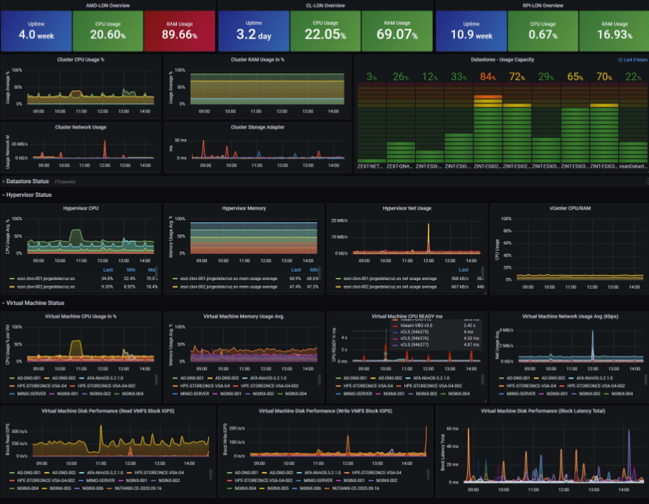

# Monitoring

   
   

> Left is our implementation of the Grafana dashboard on a monitor mounted to the front server rack. Right picture is an example screenshot of what a dashboard monitoring VMs looks like.

## The TIG Stack

| Component | Role | What It Does Here |
|---|---|---|
| **Telegraf** | Collection agent | Polls vCenter/vSphere on a schedule via the vSphere plugin, pulling host and VM-level metrics such as CPU, memory, disk I/O, network throughput, datastore usage |
| **InfluxDB** | Time-series database | Stores the metrics Telegraf collects as time-stamped data points, optimized for fast writes and time-range queries rather than general-purpose storage |
| **Grafana** | Visualization layer | Queries InfluxDB and renders the data as live dashboards. Used the community [vSphere Overview dashboard](https://grafana.com/grafana/dashboards/8159-vmware-vsphere-overview/) as a base and customized for our needs, giving easy access visibility into host and VM performance across the ESXi environment.

## An Initial Problem we Faced

Before this project, there was no visibility into the health of the lab's
virtualized services. We collected no data on our VMs in any sort of centralized place and we had no easy way to spot problems with VM health and continuosly monitor them.

## What We Built

- Built a full monitoring stack using the TIG stack: **Grafana + InfluxDB + Telegraf**,
  pulling metrics directly from the ESXi/vSphere environment
- Deployed **Uptime Kuma** for HTTP/ping-based uptime monitoring across many of the lab's
  hosted services

## Result

- Went from zero visibility into our infrastructures live health to continuous monitoring and log pulling
- Dashboards visible in classroom meant there was always easy access to data and VM and service health problems were far easier to spot
