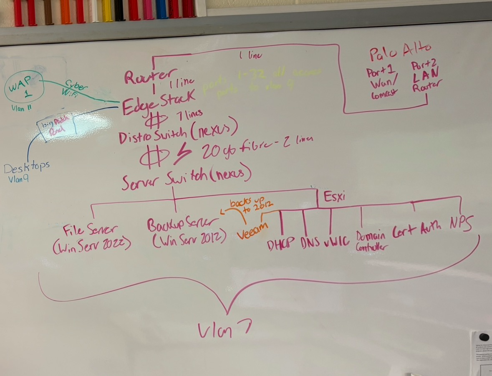
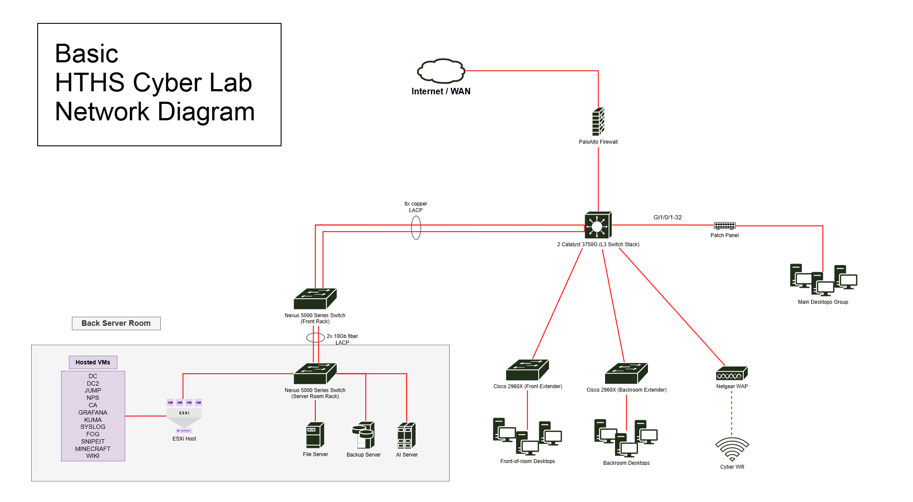

# Network Architecture
## VLAN Reference

| VLAN | Name | Purpose |
|---|---|---|
| 2 | Internet | Transit between the L3 core and firewall |
| 7 | Servers | All server infrastructure, static IPs, ESXi host, file server, backup server |
| 9 | Desktops + Wi-Fi | Wired desktops and wireless clients, DHCP-assigned |
| 99 | Management | SSH-only access to switch management interfaces, each switch has static VLAN 99 SVI |

  
  
  

> The old and broken topology is on the left, making use of a router with one link instead of a L3 switch.

## An Intial Problem we Faced

When we took over in Fall 2024, one of our biggest issues was the awfully slow local file transfer speeds. This issue became espescially apparent when we would attempt to pull down CyberPatriot practice images from the file server onto the Desktops. Transfer would take upwards of 15 minutes with multiple computers attempting to transfer at once. After a quick assessment of our network infrastructure, we realized that for the desktops to communicate with the servers, inter-VLAN routing had to occur and everything was being routed from a switch to the dedicated router through a singular Fast Ethernet link at 100Mbps. Every file transfer had to traverse this one link to this one router severely bottlenecking network performance.
## What We Built

We redesigned the network around dedicated Layer 3 switching instead of router-based
inter-VLAN routing:

- Replaced router-based intervlan routing with a stacked Cisco 3750G L3 switch pair acting as the default gateway for all VLANs
- Migrated the distribution-to-server link to 2x 10Gb fiber with LACP, and the
  core-to-distribution link to 8x copper LACP, removing single-link bottlenecks
  alongside the routing fix and allowing 8Gbps bandwidth on the transfer links which was more than enough for the lab's needs.

## Result

- Well over 10x improvement lab wide in local file transfer speeds between the file server and lab
  desktops, measured against the previous router-based setup
- Eliminated the single router as a bandwidth and single-point-of-failure bottleneck
  for all inter-VLAN traffic
- Migrated 2 major uplinks to redundant multi-link LACP (10Gb fiber + copper),
  removing single-cable failure points from the core of the network
- Design supports 75+ concurrent users across 4 VLANs with headroom for growth,
  the same architecture absorbed later additions (endpoint management, monitoring
  stack) without further redesign
